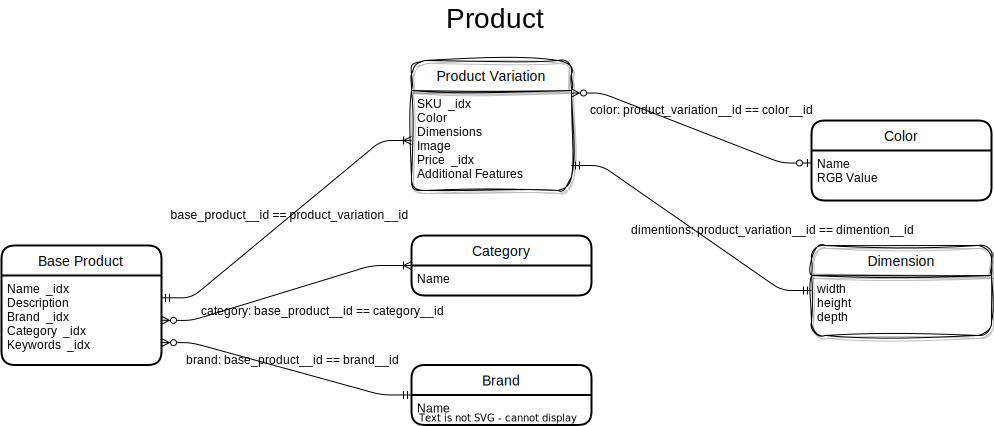
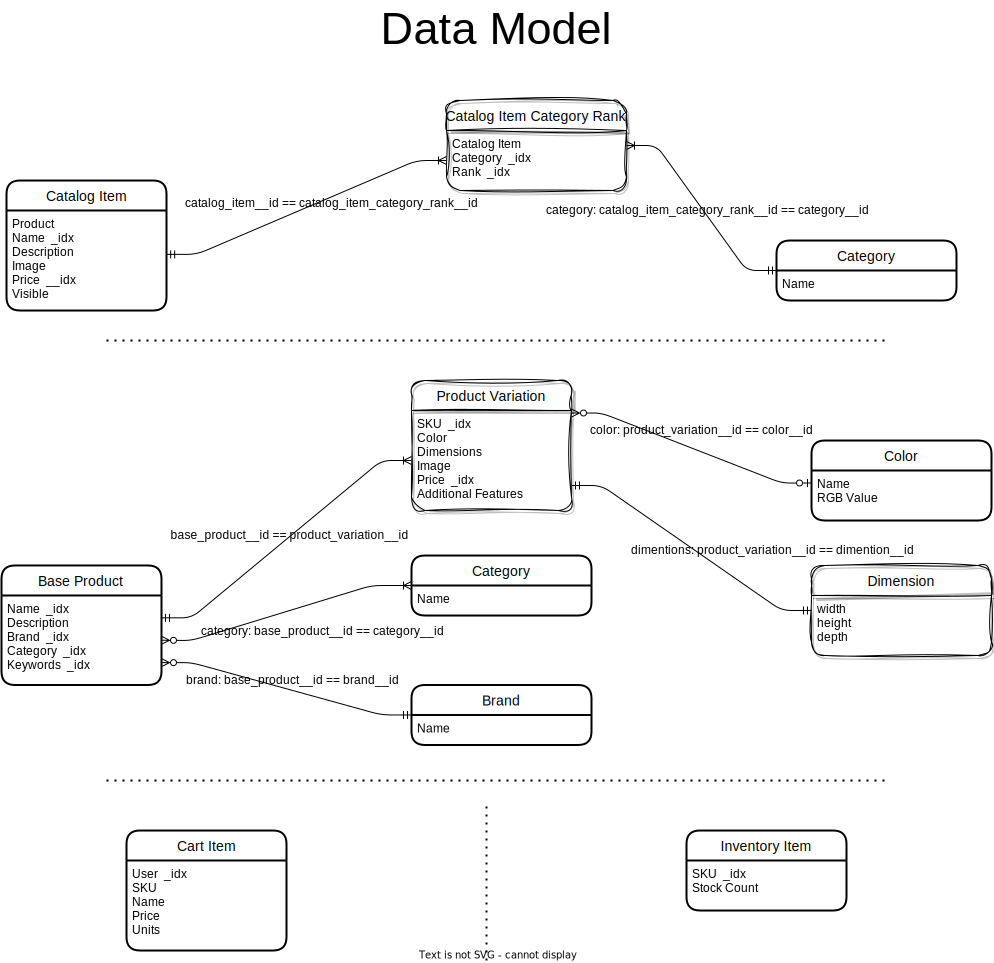

<h1 style="text-align: center">Data Models</h1>

___

This section explains the data models, their attributes and the type of persistence for these models/attributes. The [legend](#legend) for diagrams is at the bottom of this document.

## Catalog Item
Catalog item represents a single item in [catalog](#catalog) shown to the user while browsing the catalog, this item should be able to provide a good picture of the product at a glance with minimal essential information.

### Source
Catalog Item should be automatically added if a new product is introduced in the inventory. This should happen asynchronously. Moreover this source will not have value for [visible](#visible) so this would be set to true by default.

### Model Attributes
__Product__
: Reference to the product, could be SKU number.

__Name__
: Name of the product.

__Description__
: Summary of the product.

__Image__
: Image of the product.

__Price__
: Price of the product.

<b>Visible</b>
: Flag which determines whether to make this item visible to user. The flag is controlled by [Catalog Item Visibility](#catalog-item-visibility) mechanism.

### Persistence
Catalog item is persistent. The data for the fields will be duplicated from the referenced product (this flow should be automated).

### Indexes
__Name__
: Name is indexed field to allow for searching/sorting product by name.

__Price__
: Price is indexed field to allow for sorting/filtering products by price.

## Catalog Item Category Rank
Category Rank is to store catalog item's rank per category, and also it serves as join table for many-to-many relation between __Catalog Item__ and __Category__. It can be used to query the catalog by category with default ordering of catalog items by ranks within this category. This model should be driven by the [Ranking System](#ranking-system)

### Source
Catalog Item Category Rank has no source it's maintained by application logic.

### Model Attributes
__Catalog Item__
: Reference to the Catalog Item _(integer id of Catalog Item)_.

__Category__
: Category of the catalog item (product), provided by [category](#category) model.

__Rank__
: Rank of the catalog item.

### Persistence
Catalog Item Category Rank should be persistent, having it's own storage unit with indexes.

### Indexes
__Category, Rank__
: Category, Rank fields are indexed as composite index to enable filtering catalog based on category and to help sort by rank.

## Category
Category is predefined list of available catalog categories.

### Source
Should be added by Catalog Manager via DBA or a panel should be provided to Catalog Manager.

### Model Attributes
__Name__
: Category value e.g. Clothing/Eletronics etc.

### Persistence
Category should be persistent, having it's own storage unit, it has no indexes.

___
___

## Base Product
Base Product is part of product which is common to all the [variations](#product-variation) of the product.

### Source
Base Product should be added by Product Manager via DBA or a panel should be provided to Product Manager to enter Product (including [__Base Product__](#base-product) and [__Product Variation__](#product-variation)).

### Model Attributes
__Name__
: Name of the product.

__Description__
: Summary of product.

__Brand__
: Product brand, provided by [__brand__](#brand) model. Each product should belong one and only one brand.

__Category__
: One or more categories to which this product belongs. Categories should be predefined in [category](#category) model. Each product should belong to at least one category.

__Keywords__
: Comma separated list of keywords which should match when searching this product.

### Persistence
Base Product should be persistent, having it's own storage unit with indexes.

### Indexes
__Name__
: Name is indexed field to allow for searching/sorting product by name.

__Brand__
: Brand should be indexed to allow filtering products by brand.

__Category__
: Category should be indexed to allow filtering products by category.

__Keywords__
: Keywords should be indexed to allow searching products by keywords.

## Product Variation
Each product could have multiple variations having same properties in common [(Base Product)](#base-product) but with some differenes [(Product Variation)](#product-variation). The SKU property belongs to Product Variation because each variation is a different product in itself only sharing same virtual attributes (Base Product) with it's other variations.

### Source
Product Variation should be added by Product Manager via DBA or a panel should be provided to Product Manager to enter Product (including [__Base Product__](#base-product) and [__Product Variation__](#product-variation)).

### Model Attributes
__SKU__
: Unique Identifier for this particular product.

__Color__
: Color in whic this product comes. This property is not required so if deemed not significant by Product Manager, they can omit it.

__Dimensions__
: Dimensions of the product. This should be stored in [Dimension](#dimension) model. This property is also not required so Product Manager can omit this if not deemed significant by them.

__Image__
: Image of the product.

__Price__
: Price of the product.

__Additional Features__
: Comma separated list of additional feature as key=value pair.

### Persistence
Product Variation should be persistent, having it's own storage unit with indexes.

### Indexes
__SKU__
: SKU is indexed to allow searching for product by SKU.

__Price__
: Price is indexed to allow filtering products by price.

## Category
Same as category defined earlier in Catalog Model [Category](#category). Just it will be duplicated in Product Model.

## Brand
Brand is predefined list of available product brands.

### Source
Should be added by Product Manager via DBA or a panel should be provided to Product Manager.

### Model Attributes
__Name__
: Name of the brand e.g. Sony, Toshiba etc.

### Persistence
Brand should be persistent, having it's own storage unit, it has no indexes.

## Color
Color is predefined list of colors.

### Source
Color can be entered on demand.

### Model Attributes
__Name__
: Name of the color e.g. white, black etc.

__RGB Value__
: RGB Value for this color to be rendered by frontend resulting in color displayed to the users.

### Persistence
Color should be persistent, having it's own storage unit, it has no indexes.

## Dimension
Dimension may be 1D (l), 2D (w x h) or 3D (w x h x d). Semantics might not hold well for all dimensions e.g. _length_ might not be good name for 1D in some contexts but this single model should be okay for any of the 3 dimensions in this limited use case (dimensions of products). One product can have only one value for dimensions.

### Source
Should be added during the process of adding/updating the product.

### Model Attributes
__width__
: Widht of the product e.g. 10 inches. This attribute is required.

__height__
: Height of the product e.g. 50 cm. This attribute is optional in case of 1D.

__depth__
: Depth of the product e.g. 80 mm. This attribute is optional in case of 2D.

### Persistence
Dimension should be persistent, having it's own storage unit, it has no indexes.

___
___

## Inventory Item
Inventory Item holds data for inventory items i.e. products but from view point of inventory management e.g. products in stock.

### Source
Inventory Items should be added by Inventory Manager via DBA or a panel should be provided to Inventory Manager to enter Inventory Items.

### Model Attributes
__SKU__
: SKU of the product in inventory.

__Stock Count__
: number of units in stock.

### Persistence
Inventory Item should be persistent, having it's own storage unit with indexes.

### Indexes
__SKU__
: SKU is indexed field to allow for searching inventory item by SKU.

___
___

## Cart Item
Cart Item holds items (products) added to the shopping cart by user from the catalog during the shopping journey.

### Source
Cart Items are added or removed by user while shopping. This model should be behind some cache or run by events for high speed frequent updates.

### Model Attributes
__User__
: User who this cart item belongs to.

__SKU__
: SKU of item.

__Name__
: Name of the item.

__Price__
: Price of the item.

__Units__
: Number of units of this item in the cart.

### Persistence
Cart Item should be persistent, having it's own storage unit with indexes.

### Indexes
__User__
: User is indexed field to allow querying all cart items belonging to the same user.

___
\
\
\
 

## Relevant Definitions/Concepts
### Catalog
Catalog is a list of products shown to the users with minimal but important information like name, picture or brand of the product. This list should enable user to see multiple available products at a glance. The catalog can offer user filtering products based on category or price range. Catalog should sort products according to the [ranking system](#ranking-system).

### Ranking System
Ranking system includes a rank _(integer)_ per category _(catalog item category)_ reflected in data model [Catalog Item Category Rank](#catalog-item-category-rank). The rank increases upon any [_rank-increase_](#rank-increase-event) event or it decreases upon any [_rank-decrease_](#rank-decrease-event) event. Now with this kind of system we could run into integer overflow issue if rank for a product is continuously receiving _rank-increase_ events, so to mitigate this a cron service or a trigger could be implemented which could translate the ranks _(integers)_ back to 0 on number line. This problem could further open up if only few products are getting rank increments, in that case a max-rank and timed-rank could be used to cleanup this void, but for now this problem is left open-ended.

### Rank Increase Event
Rank Increase event can be any of the events when products is searched, added to cart, purchased etc. 

### Rank Decrease Event
Rank Decrease event can be any of the events when product is removed from cart, returned etc.

### Catalog Item Visibility
Catalog items can be omitted from user view depending on different circumstances like for being out of stock or limiting products for specific vendors etc. Catalog Item should provide a flag which can be set to false if the item should not be made visible to the user.

___
\
\
\
 

# Complete Data Model

# Legend
