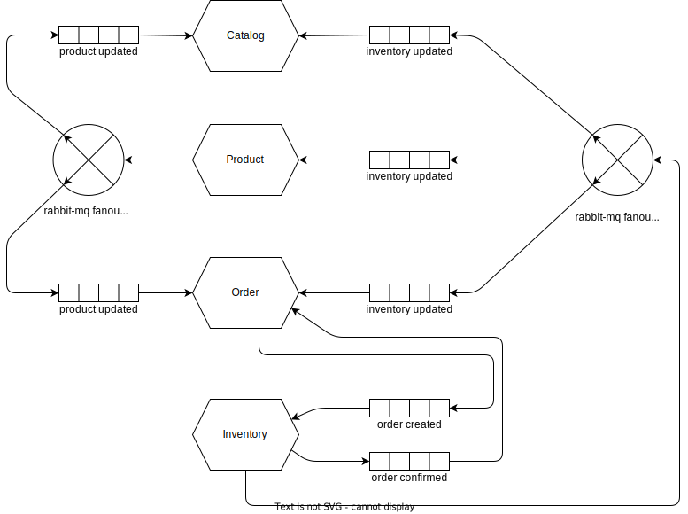

## Internal Service Communication

This diagram focuses on how the communication between internal services looks like to achive functionality of stirzz app. The scope of this diagram does not include infrastructure, routing or security.

### Services
**Catalog Service**
: Catalog Service is responsible for managing catalog shown to the users.

**Product Service**
: Product Service is reponsible for handling source of product details i.e. product details entered by Product Manager. Product updates in this service should be communicated to other services as this service holds the source of truth for product details.

**Order Service**
: Order Service is responsible for hadling user orders and their confirmation, additionally it also hold responsibility for hadling shopping cart which can be separated out to another service later if required.

**Inventory Service**
: Inventory Service is responsible for inventory management.

## Infrastructure

This diagram focuses on infrastructre and security it includes following components.
- **Api Gateway**: responsible for authentication (delegated to auth-provider) and authorization.
- **Auth Provider**: responsible for user authentication and user authentication token issuance.
- **Ingress**: responsible for routing to k8s services.
- **K8S Services**: for load-balancing incoming requests to micro-service pods.
- **Pod Replicaset**: Pods replicas for each micro-service.
- **Rabbit MQ Server**: Rabbit MQ Server for handling asynchronous communication between services using rabbitmq exchanges and queues.
- **Database Cluster**: Database for each micro-service.

*Important!* all pods for one service can connect to it's database directly hence connection isolation should be carefully implemented.