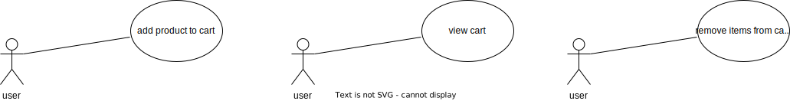
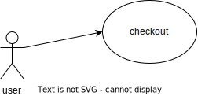
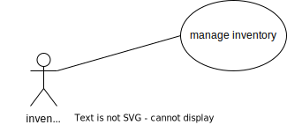

## User Use-Cases

### As a user I want to browse the products catalog

1. I should be able to get list of products having basic information
2. I should be able to search a product using a keyword
3. I should be able to get details of any product

### As a user I want cart functionality as below

1. I want to be able to add the products I wish to order to my cart
2. I want to be able to view my cart having all items I added
3. I want to be able to remove items from my cart

### As a user I want to checkout with my cart with following options
1. I want to see total amount
2. I want to see delivery charges
3. I want to see GST amount
4. I want to be able to pay with credit card or cash on delivery

## Inventory Manager Use-Cases

### As an inventory manager I want to manage inventory with following options

1. I want to add new SKUs to inventory
2. I want to view current inventory list
3. I want to update inventory units
4. I want to remove units from inventory